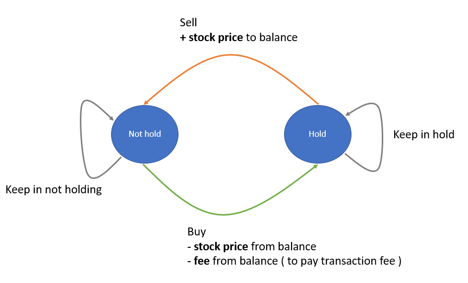

```python
class Solution:
    def maxProfit(self, prices: List[int], fee: int) -> int:
        max_profit, min_price, pre_min_price = [0], float('inf'), float('inf')
        for i in range(len(prices)):
            min_price = min(min_price, prices[i])
            profit = prices[i] - min_price - fee
            merge_profit = prices[i] - pre_min_price -fee
            if merge_profit > max_profit[-1] + profit and merge_profit > max_profit[-1]:
                max_profit[-1] = merge_profit
                min_price = float('inf')
            elif profit > 0:
                max_profit.append(profit)
                pre_min_price = min_price
                min_price = float('inf')
            
        return sum(max_profit)

```


```python
# 討論區解答
class Solution:
    def maxProfit(self, prices: List[int], fee: int) -> int:
        dp_hold, dp_not_hold = -float('inf'), 0
        
        for stock_price in prices:
            
            prev_hold, prev_not_hold = dp_hold, dp_not_hold
            
            # either keep not hold, or sell out today at stock price
            dp_not_hold = max(prev_not_hold, prev_hold + stock_price)
            
            # either keep hold, or buy in today at stock price and pay transaction fee for this trade
            dp_hold = max(prev_hold, prev_not_hold - stock_price - fee)
        
        # maximum profit must be in not-hold state
        return dp_not_hold
		
```



> 思路總結：Dynamic programming + machine status